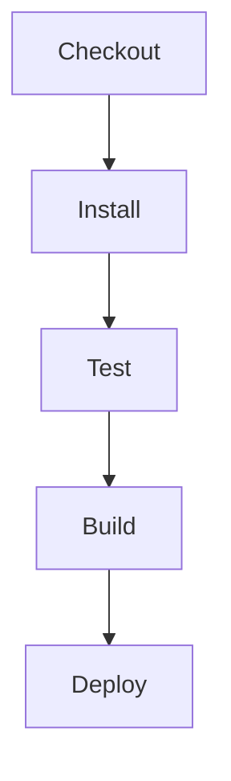
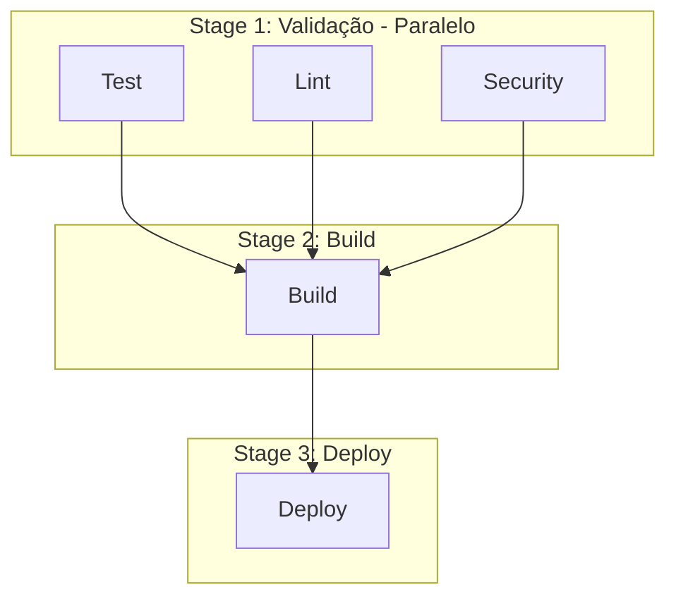
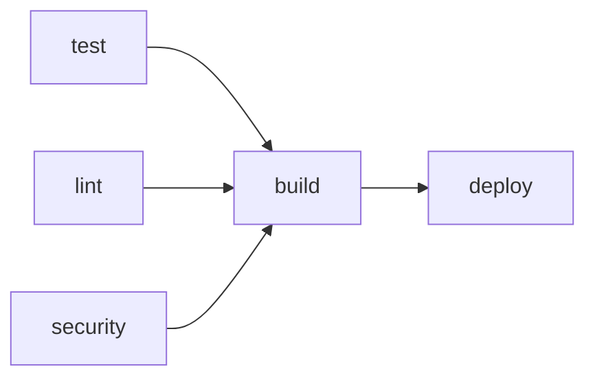
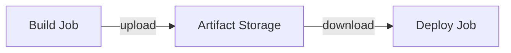
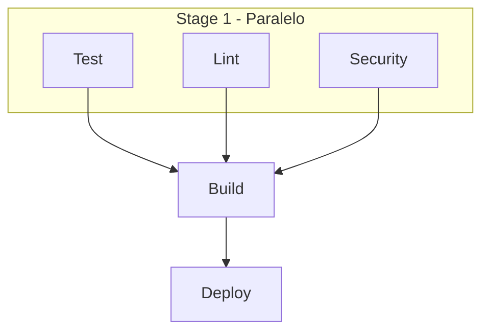

# 🎬 Vídeo 2.1 - Otimizando Pipelines: Estratégias Multistage

**Aula**: 2 - Otimização de Pipelines  
**Vídeo**: 2.1  
**Temas**: Conceito de stages em pipelines; Reestruturação do pipeline; Jobs distintos com needs; Artifacts

---

## 📚 Parte 1: Conceito Multistage

### Passo 1: Problema do Pipeline Monolítico

**Pipeline monolítico (Aula 1):**



**Problema**: Tudo sequencial, execução lenta!

**Pipeline multistage (Aula 2):**



**Benefício**: Jobs paralelos = execução mais rápida!

---

## 🚀 Parte 2: Criar Pipeline Multistage

### Passo 2: Estrutura do Projeto

```bash
cd ~/fiap-dclt-aula02

# Ver estrutura
ls -la

# Estrutura esperada:
# .
# ├── .github/
# │   └── workflows/       ← Workflows serão criados aqui
# ├── app/
# │   ├── src/
# │   ├── tests/
# │   └── package.json
# └── README.md
```

### Passo 3: Criar Workflow Multistage

**Linux/Mac:**
```bash
# Criar diretório de workflows (se não existir)
mkdir -p .github/workflows

# Criar workflow multistage
cat > .github/workflows/ci-multistage.yml << 'EOF'
# ============================================
# WORKFLOW: CI Pipeline Multistage
# ============================================
name: 🔄 CI Multistage Pipeline

on:
  push:
    branches: [ main ]
  workflow_dispatch:

env:
  NODE_VERSION: '20'

jobs:
  # ============================================
  # STAGE 1: VALIDAÇÃO (Paralelo)
  # Jobs sem "needs" executam em paralelo
  # ============================================
  test:
    name: 🧪 Run Tests
    runs-on: ubuntu-latest
    steps:
      - name: 📥 Checkout
        uses: actions/checkout@v4
      
      - name: 🔧 Setup Node.js
        uses: actions/setup-node@v4
        with:
          node-version: ${{ env.NODE_VERSION }}
          cache: 'npm'
          cache-dependency-path: app/package-lock.json
      
      - name: 📦 Install dependencies
        working-directory: app
        run: npm ci
      
      - name: 🧪 Run tests
        working-directory: app
        run: npm test
  
  lint:
    name: 🔍 Lint Code
    runs-on: ubuntu-latest
    steps:
      - name: 📥 Checkout
        uses: actions/checkout@v4
      
      - name: 🔧 Setup Node.js
        uses: actions/setup-node@v4
        with:
          node-version: ${{ env.NODE_VERSION }}
          cache: 'npm'
          cache-dependency-path: app/package-lock.json
      
      - name: 📦 Install dependencies
        working-directory: app
        run: npm ci
      
      - name: 🔍 Run lint
        working-directory: app
        run: npm run lint
  
  security:
    name: 🔒 Security Scan
    runs-on: ubuntu-latest
    steps:
      - name: 📥 Checkout
        uses: actions/checkout@v4
      
      - name: 🔒 Run security audit
        working-directory: app
        run: npm audit --audit-level=moderate || true
  
  # ============================================
  # STAGE 2: BUILD (Depende do Stage 1)
  # "needs" define dependências entre jobs
  # ============================================
  build:
    name: 🏗️ Build
    runs-on: ubuntu-latest
    needs: [test, lint, security]
    steps:
      - name: 📥 Checkout
        uses: actions/checkout@v4
      
      - name: 🔧 Setup Node.js
        uses: actions/setup-node@v4
        with:
          node-version: ${{ env.NODE_VERSION }}
          cache: 'npm'
          cache-dependency-path: app/package-lock.json
      
      - name: 📦 Install dependencies
        working-directory: app
        run: npm ci
      
      - name: 🏗️ Build application
        working-directory: app
        run: npm run build
      
      # Upload dos arquivos buildados para próximo stage
      - name: 📤 Upload artifacts
        uses: actions/upload-artifact@v4
        with:
          name: build-artifacts
          path: app/dist/
          retention-days: 7
  
  # ============================================
  # STAGE 3: DEPLOY (Depende do Stage 2)
  # ============================================
  deploy:
    name: 🚀 Deploy
    runs-on: ubuntu-latest
    needs: build
    if: github.ref == 'refs/heads/main'
    steps:
      # Download do artifact do job anterior
      - name: 📥 Download artifacts
        uses: actions/download-artifact@v4
        with:
          name: build-artifacts
          path: ./dist
      
      - name: 🚀 Deploy
        run: |
          echo "📦 Arquivos para deploy:"
          ls -la ./dist
          echo "🚀 Deploying..."
EOF
```

**Windows (PowerShell):**
```powershell
# Criar diretório de workflows (se não existir)
New-Item -ItemType Directory -Force -Path .github/workflows

# Criar workflow multistage
@'
# ============================================
# WORKFLOW: CI Pipeline Multistage
# ============================================
name: 🔄 CI Multistage Pipeline

on:
  push:
    branches: [ main ]
  workflow_dispatch:

env:
  NODE_VERSION: '20'

jobs:
  # ============================================
  # STAGE 1: VALIDAÇÃO (Paralelo)
  # Jobs sem "needs" executam em paralelo
  # ============================================
  test:
    name: 🧪 Run Tests
    runs-on: ubuntu-latest
    steps:
      - name: 📥 Checkout
        uses: actions/checkout@v4
      
      - name: 🔧 Setup Node.js
        uses: actions/setup-node@v4
        with:
          node-version: ${{ env.NODE_VERSION }}
          cache: 'npm'
          cache-dependency-path: app/package-lock.json
      
      - name: 📦 Install dependencies
        working-directory: app
        run: npm ci
      
      - name: 🧪 Run tests
        working-directory: app
        run: npm test
  
  lint:
    name: 🔍 Lint Code
    runs-on: ubuntu-latest
    steps:
      - name: 📥 Checkout
        uses: actions/checkout@v4
      
      - name: 🔧 Setup Node.js
        uses: actions/setup-node@v4
        with:
          node-version: ${{ env.NODE_VERSION }}
          cache: 'npm'
          cache-dependency-path: app/package-lock.json
      
      - name: 📦 Install dependencies
        working-directory: app
        run: npm ci
      
      - name: 🔍 Run lint
        working-directory: app
        run: npm run lint
  
  security:
    name: 🔒 Security Scan
    runs-on: ubuntu-latest
    steps:
      - name: 📥 Checkout
        uses: actions/checkout@v4
      
      - name: 🔒 Run security audit
        working-directory: app
        run: npm audit --audit-level=moderate || true
  
  # ============================================
  # STAGE 2: BUILD (Depende do Stage 1)
  # "needs" define dependências entre jobs
  # ============================================
  build:
    name: 🏗️ Build
    runs-on: ubuntu-latest
    needs: [test, lint, security]
    steps:
      - name: 📥 Checkout
        uses: actions/checkout@v4
      
      - name: 🔧 Setup Node.js
        uses: actions/setup-node@v4
        with:
          node-version: ${{ env.NODE_VERSION }}
          cache: 'npm'
          cache-dependency-path: app/package-lock.json
      
      - name: 📦 Install dependencies
        working-directory: app
        run: npm ci
      
      - name: 🏗️ Build application
        working-directory: app
        run: npm run build
      
      - name: 📤 Upload artifacts
        uses: actions/upload-artifact@v4
        with:
          name: build-artifacts
          path: app/dist/
          retention-days: 7
  
  # ============================================
  # STAGE 3: DEPLOY (Depende do Stage 2)
  # ============================================
  deploy:
    name: 🚀 Deploy
    runs-on: ubuntu-latest
    needs: build
    if: github.ref == 'refs/heads/main'
    steps:
      - name: 📥 Download artifacts
        uses: actions/download-artifact@v4
        with:
          name: build-artifacts
          path: ./dist
      
      - name: 🚀 Deploy
        run: |
          echo "📦 Arquivos para deploy:"
          ls -la ./dist
          echo "🚀 Deploying..."
'@ | Out-File -FilePath .github/workflows/ci-multistage.yml -Encoding UTF8
```

### Passo 4: Entendendo o `needs`

**Como funciona:**



- `needs: [test, lint, security]` → Build só executa se **todos** passarem
- `needs: build` → Deploy só executa se build passar
- Jobs sem `needs` executam em **paralelo**

---

## 📦 Parte 3: Artifacts

### Passo 5: Como Artifacts Funcionam

**Artifacts permitem passar arquivos entre jobs:**



**Upload (no job de build):**
```yaml
- uses: actions/upload-artifact@v4
  with:
    name: build-artifacts
    path: app/dist/
```

**Download (no job de deploy):**
```yaml
- uses: actions/download-artifact@v4
  with:
    name: build-artifacts
    path: ./dist
```

---

## 🔄 Parte 4: Executar Pipeline

### Passo 6: Commit e Push

**Linux/Mac:**
```bash
cd ~/fiap-dclt-aula02

# Ver arquivos criados
ls -la .github/workflows/

# Adicionar workflow
git add .github/workflows/ci-multistage.yml

# Commit
git commit -m "feat(video-2.1): adicionar pipeline multistage"

# Push
git push origin main
```

**Windows (PowerShell):**
```powershell
cd ~\fiap-dclt-aula02

# Ver arquivos criados
Get-ChildItem .github/workflows/

# Adicionar workflow
git add .github/workflows/ci-multistage.yml

# Commit
git commit -m "feat(video-2.1): adicionar pipeline multistage"

# Push
git push origin main
```

### Passo 7: Acompanhar Execução

**No GitHub:**
1. Ir para **Actions**
2. Clicar no workflow **CI Multistage Pipeline**
3. Ver visualização gráfica dos stages

**Visualização esperada:**



---

**FIM DO VÍDEO 2.1** ✅
