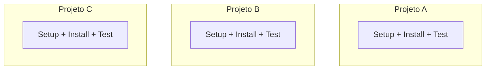
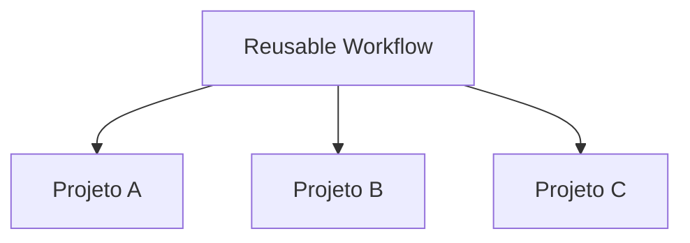
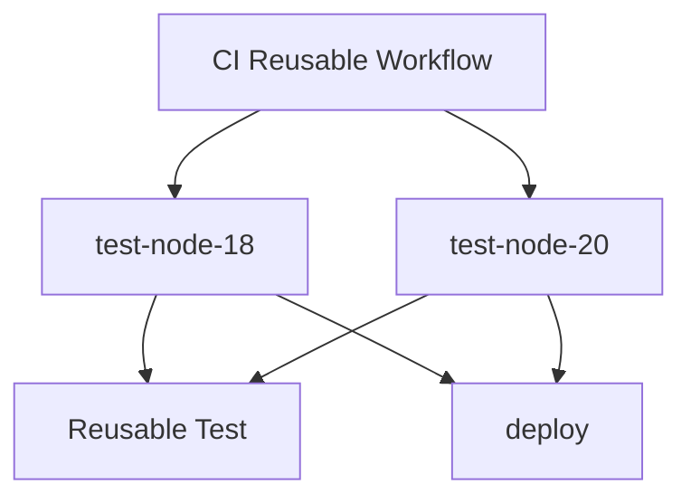
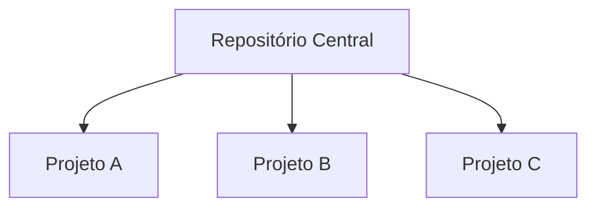

# 🎬 Vídeo 2.3 - Governança e Padronização de Pipelines em Escala

**Aula**: 2 - Otimização de Pipelines  
**Vídeo**: 2.3  
**Temas**: Princípios de workflows reutilizáveis; Criação e chamada de workflow reutilizável; Arquitetura multi-tenant

---

## 📚 Parte 1: Conceito de Reutilização

### Passo 1: Problema da Duplicação

**Sem reutilização:**



**Problema**: Código duplicado em 3 lugares! Atualizar = mudar em todos.

**Com reutilização:**



**Benefício**: Atualizar em 1 lugar = todos atualizados!

---

## 🔧 Parte 2: Criar Workflow Reutilizável

### Passo 2: Estrutura do Projeto

```bash
cd ~/fiap-dclt-aula02

# Estrutura atual:
# .github/
# └── workflows/
#     ├── ci-multistage.yml    ← Vídeo 2.1
#     └── ci-matrix.yml        ← Vídeo 2.2
```

### Passo 3: Criar Workflow Reutilizável

**Linux/Mac:**
```bash
cd ~/fiap-dclt-aula02

# Criar workflow reutilizável
cat > .github/workflows/reusable-test.yml << 'EOF'
# ============================================
# REUSABLE WORKFLOW: Test
# Pode ser chamado por outros workflows
# ============================================
name: 🔄 Reusable Test

# ============================================
# WORKFLOW_CALL: Torna este workflow reutilizável
# Diferente de "on: push", este workflow só executa
# quando chamado por outro workflow
# ============================================
on:
  workflow_call:
    # Parâmetros que quem chama pode passar
    inputs:
      node-version:
        description: 'Versão do Node.js'
        required: false
        type: string
        default: '20'

# ============================================
# JOBS: O que este workflow faz
# ============================================
jobs:
  test:
    name: 🧪 Run Tests
    runs-on: ubuntu-latest
    
    steps:
      - name: 📥 Checkout
        uses: actions/checkout@v4
      
      - name: 🔧 Setup Node.js ${{ inputs.node-version }}
        uses: actions/setup-node@v4
        with:
          node-version: ${{ inputs.node-version }}
          cache: 'npm'
          cache-dependency-path: app/package-lock.json
      
      - name: 📦 Install dependencies
        working-directory: app
        run: npm ci
      
      - name: 🧪 Run tests
        working-directory: app
        run: npm test
EOF
```

**Windows (PowerShell):**
```powershell
cd ~\fiap-dclt-aula02

# Criar workflow reutilizável
@'
# ============================================
# REUSABLE WORKFLOW: Test
# Pode ser chamado por outros workflows
# ============================================
name: 🔄 Reusable Test

# ============================================
# WORKFLOW_CALL: Torna este workflow reutilizável
# Diferente de "on: push", este workflow só executa
# quando chamado por outro workflow
# ============================================
on:
  workflow_call:
    inputs:
      node-version:
        description: 'Versão do Node.js'
        required: false
        type: string
        default: '20'

# ============================================
# JOBS: O que este workflow faz
# ============================================
jobs:
  test:
    name: 🧪 Run Tests
    runs-on: ubuntu-latest
    
    steps:
      - name: 📥 Checkout
        uses: actions/checkout@v4
      
      - name: 🔧 Setup Node.js ${{ inputs.node-version }}
        uses: actions/setup-node@v4
        with:
          node-version: ${{ inputs.node-version }}
          cache: 'npm'
          cache-dependency-path: app/package-lock.json
      
      - name: 📦 Install dependencies
        working-directory: app
        run: npm ci
      
      - name: 🧪 Run tests
        working-directory: app
        run: npm test
'@ | Out-File -FilePath .github/workflows/reusable-test.yml -Encoding UTF8
```

> **⚠️ Importante**: Este workflow **não executa sozinho**! Ele precisa ser chamado por outro workflow.

### Passo 4: Diferença Chave

| Workflow Normal | Workflow Reutilizável |
|-----------------|----------------------|
| `on: push` | `on: workflow_call` |
| Executa em eventos | Executa quando chamado |
| Não recebe parâmetros | Recebe `inputs` |

**Fluxo:**


---

## 🔄 Parte 3: Chamar Workflow Reutilizável

### Passo 5: Criar Workflow que Chama o Reutilizável

**Linux/Mac:**
```bash
# Criar workflow que chama o reutilizável
cat > .github/workflows/ci-reusable.yml << 'EOF'
# ============================================
# WORKFLOW: CI com Workflows Reutilizáveis
# Demonstra como chamar workflows reutilizáveis
# ============================================
name: 🚀 CI with Reusable Workflows

on:
  push:
    branches: [ main ]
  workflow_dispatch:

jobs:
  # ============================================
  # Chamar workflow reutilizável com Node 18
  # ============================================
  test-node-18:
    name: 🧪 Test Node 18
    uses: ./.github/workflows/reusable-test.yml
    with:
      node-version: '18'
  
  # ============================================
  # Chamar workflow reutilizável com Node 20
  # ============================================
  test-node-20:
    name: 🧪 Test Node 20
    uses: ./.github/workflows/reusable-test.yml
    with:
      node-version: '20'
  
  # ============================================
  # Deploy só após todos os testes passarem
  # ============================================
  deploy:
    name: 🚀 Deploy
    runs-on: ubuntu-latest
    needs: [test-node-18, test-node-20]
    
    steps:
      - name: 🚀 Deploy
        run: echo "✅ Todos os testes passaram! Deploying..."
EOF
```

**Windows (PowerShell):**
```powershell
# Criar workflow que chama o reutilizável
@'
# ============================================
# WORKFLOW: CI com Workflows Reutilizáveis
# Demonstra como chamar workflows reutilizáveis
# ============================================
name: 🚀 CI with Reusable Workflows

on:
  push:
    branches: [ main ]
  workflow_dispatch:

jobs:
  # ============================================
  # Chamar workflow reutilizável com Node 18
  # ============================================
  test-node-18:
    name: 🧪 Test Node 18
    uses: ./.github/workflows/reusable-test.yml
    with:
      node-version: '18'
  
  # ============================================
  # Chamar workflow reutilizável com Node 20
  # ============================================
  test-node-20:
    name: 🧪 Test Node 20
    uses: ./.github/workflows/reusable-test.yml
    with:
      node-version: '20'
  
  # ============================================
  # Deploy só após todos os testes passarem
  # ============================================
  deploy:
    name: 🚀 Deploy
    runs-on: ubuntu-latest
    needs: [test-node-18, test-node-20]
    
    steps:
      - name: 🚀 Deploy
        run: echo "✅ Todos os testes passaram! Deploying..."
'@ | Out-File -FilePath .github/workflows/ci-reusable.yml -Encoding UTF8
```

### Passo 6: Sintaxe de Chamada

**Para chamar um workflow reutilizável:**

```yaml
jobs:
  meu-job:
    uses: ./.github/workflows/reusable-test.yml  # Caminho do workflow
    with:                                         # Parâmetros
      node-version: '18'
```

**Visualização:**



---

## 🏢 Parte 4: Arquitetura Multi-Tenant

### Passo 7: Visão Organizacional

**Em uma organização com múltiplos projetos:**



**Chamar de outro repositório:**

```yaml
jobs:
  test:
    uses: minha-org/workflows-library/.github/workflows/reusable-test.yml@main
    with:
      node-version: '20'
```

**Benefícios:**
- ✅ **Governança**: Padrões centralizados
- ✅ **Manutenção**: Atualizar em 1 lugar
- ✅ **Consistência**: Todos usam mesma versão

---

## 🚀 Parte 5: Executar e Testar

### Passo 8: Commit e Push

**Linux/Mac:**
```bash
cd ~/fiap-dclt-aula02

# Ver arquivos criados
ls -la .github/workflows/

# Adicionar arquivos
git add .github/workflows/reusable-test.yml
git add .github/workflows/ci-reusable.yml

# Commit
git commit -m "feat(video-2.3): adicionar workflows reutilizáveis"

# Push
git push origin main
```

**Windows (PowerShell):**
```powershell
cd ~\fiap-dclt-aula02

# Ver arquivos criados
Get-ChildItem .github/workflows/

# Adicionar arquivos
git add .github/workflows/reusable-test.yml
git add .github/workflows/ci-reusable.yml

# Commit
git commit -m "feat(video-2.3): adicionar workflows reutilizáveis"

# Push
git push origin main
```

### Passo 9: Ver Execução

**No GitHub Actions:**
1. Ir para **Actions**
2. Clicar no workflow **CI with Reusable Workflows**
3. Ver os jobs executando

**Resultado esperado:**

```
🚀 CI with Reusable Workflows
├─ 🧪 Test Node 18 ✅
├─ 🧪 Test Node 20 ✅
└─ 🚀 Deploy ✅
```

---

**FIM DO VÍDEO 2.3** ✅
